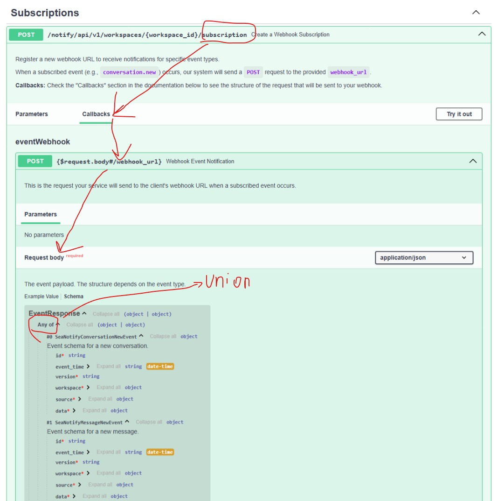

How to show in OpenAPI the schema of your callback requests?

Run `main.py` with:

    pip install fastapi "pydantic>=2.0" uvicorn
    # pydantic<2.0
    uvicorn main_pydantic_1:app --reload
    # pydantic>=2.0
    uvicorn main_pydantic_2:app --reload

Then go to http://127.0.0.1:8000/docs#/callbacks/post__request_body__webhook_url_

You'll see the callback URL and how it displays the Union of all kinds of schema.

Here's a screenshot of how the callback schema appears in the OpenAPI UI:



# Pydantic v1 vs. vs2


This guide explains the key differences between Pydantic v1 and v2 when generating complex OpenAPI specifications in FastAPI, particularly for documenting webhook callbacks with multiple possible event schemas (`Union` types). It also provides concrete tips for successfully implementing this in a Pydantic v1 codebase.

## The Core Difference: Schema Generation Engine

The fundamental change between Pydantic v1 and v2 is a ground-up rewrite of the core validation and schema generation logic in Rust.

  * **Pydantic v1**: A mature and stable library written in pure Python. Its schema generation is powerful but sometimes requires manual manipulation for advanced cases. The primary method for generating a schema for a single model is `.schema()`.
  * **Pydantic v2**: A high-performance version with its core logic in Rust. It was designed with a more robust and standards-compliant JSON Schema generation system from the start. It provides new, more powerful utility functions like `model_json_schema` and `pydantic.json_schema.models_json_schema` that simplify complex scenarios.

-----

## Impact on Documenting `Union` Types (for `oneOf`)

This difference is most apparent when trying to create an OpenAPI schema for a `Union` of different models, which should translate to a `oneOf` keyword in the specification.

### Pydantic v2 Approach (The "Easy Way")

Pydantic v2 provides a dedicated tool for this exact problem: `pydantic.json_schema.models_json_schema`.

```python
# Pydantic v2
from pydantic.json_schema import models_json_schema

event_models = Union[ModelA, ModelB].__args__
event_schemas, top_level_defs = models_json_schema(
    [(model, 'validation') for model in event_models],
    ref_template="#/components/schemas/{model}"
)

# `event_schemas` is now a perfect {"oneOf": [...]} dictionary
# `top_level_defs` contains all the necessary component schemas
```

This single function call handles everything: it generates schemas for `ModelA` and `ModelB`, pulls out any nested model definitions, and builds the correct `oneOf` structure. It's concise and designed for this purpose.

### Pydantic v1 Approach (The "Manual Way")

Pydantic v1 lacks a direct equivalent to `models_json_schema`. You must manually replicate its logic.

1.  **Iterate Models**: You loop through each model in the `Union`.
2.  **Generate Individual Schemas**: You call the standard `.schema()` method on each model.
3.  **The "Definitions" Problem**: When `.schema()` is called on a model that contains *other* Pydantic models (e.g., `SeaNotifyConversationNewEvent` contains `EventSchemaBase`, which contains `SeaNotifyWorkspaceSchema`), it places the schemas for those nested models in a local `definitions` key within the generated schema. These definitions are not globally visible in the final OpenAPI spec.
4.  **"Hoist" the Definitions**: You must manually find this `definitions` dictionary, iterate through it, and copy each nested schema into the main `/components/schemas` object of the final OpenAPI document. This makes them globally accessible.
5.  **Build `oneOf` Manually**: After processing each model, you manually construct the `{"oneOf": [...]}` dictionary by adding a `$ref` to each of the main event models you just added to `/components/schemas`.

This is precisely what the Pydantic v1-compatible solution does in the `custom_openapi` function.

-----

## Tips for Writing OpenAPI Callbacks in FastAPI with Pydantic v1

If you are working in a Pydantic v1 codebase, follow these tips to avoid common pitfalls.

#### 1\. Always Use a `custom_openapi` Function

Do not rely on passing `callbacks=` directly to the `@app.post()` decorator. While it can work for simple cases, it's less reliable across FastAPI versions and often fails with complex modifications. Overriding `app.openapi` with your own function gives you full, predictable control over the final output.

```python
# The reliable pattern for Pydantic v1
def custom_openapi():
    if app.openapi_schema:
        return app.openapi_schema
    # ... your logic here ...
    app.openapi_schema = openapi_schema
    return app.openapi_schema

app.openapi = custom_openapi
```

#### 2\. Master the "Hoist Definitions" Pattern

This is the most critical step. A `$ref` like `"$ref": "#/definitions/SeaNotifyWorkspaceSchema"` will fail because Swagger UI looks for it at `#/components/schemas/SeaNotifyWorkspaceSchema`. You **must** move the nested schemas.

```python
# The "hoisting" logic
model_schema = model.schema(ref_template="#/components/schemas/{model}")

if "definitions" in model_schema:
    for def_name, def_schema in model_schema["definitions"].items():
        # Move from local 'definitions' to global 'components/schemas'
        openapi_schema["components"]["schemas"][def_name] = def_schema
    # Clean up the now-empty definitions key
    del model_schema["definitions"]
```

#### 3\. Access Union Members with `.__args__`

This is the standard, correct way to get a tuple of the types contained within a `Union`.

```python
EventResponse = Union[ModelA, ModelB]
event_models = EventResponse.__args__  # This gives you (ModelA, ModelB)
```

#### 4\. Build and Debug Incrementally

Don't try to write the whole `custom_openapi` function at once.

1.  Start by getting just one model to appear correctly in `components/schemas`.
2.  Then, implement the loop.
3.  Add the logic to hoist definitions.
4.  Finally, add the `oneOf` construction.
    Use `print(openapi_schema)` at various stages to inspect the dictionary and see how your code is modifying it.